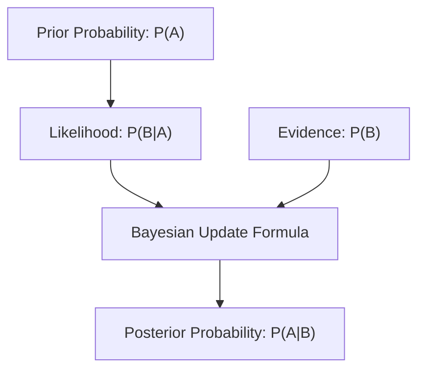

# 📚 Module 09: Bayes' Theorem (बेझचा सिद्धांत)

This module covers conditional probability, prior and posterior updates, and the mathematical framework of Bayes' Theorem.

---

## 1. Topic Introduction (विषय ओळख)

### English:
* **What is it?**: Bayes' Theorem is a mathematical formula that calculates the probability of an event based on prior knowledge of conditions related to the event.
* **Why was it created?**: To update beliefs or probabilities dynamically as new evidence or data becomes available.
* **Who uses it?**: Machine learning engineers (Naive Bayes classifiers), cybersecurity analysts (spam filtering), and medical diagnostics.
* **When should we use it?**: When you need to calculate conditional probabilities ($P(A|B)$) and already know the reverse probability ($P(B|A)$).

### Marathi (मराठी):
* **हे काय आहे?**: बेझचा सिद्धांत (Bayes' Theorem) हे एक गणिती सूत्र आहे जे एखाद्या घटनेशी संबंधित पूर्वज्ञानाच्या (Prior knowledge) आधारे त्या घटनेची संभाव्यता (Probability) मोजते.
* **हे का तयार केले गेले?**: नवीन पुरावे किंवा डेटा मिळाल्यावर मूळ गृहीतकांची संभाव्यता बदलण्यासाठी (Update करण्यासाठी).
* **हे केव्हा वापरावे?**: जेव्हा आपल्याला कंडिशनल प्रोबॅबिलिटी ($P(A|B)$) मोजायची असते आणि आपल्याला तिच्या उलट संभाव्यता ($P(B|A)$) आधीपासून माहित असते.

### Hinglish:
* **What is it?**: Ye conditional probability calculate karne ka mathematical formula hai jo new evidence ke aane par purani probability ko update karta hai.
* **Industry Importance**: Machine learning me classifier (Naive Bayes) and medical diagnostics me positive predictive value nikalne ke liye bohot use hota hai.

---

## 2. Importance Score

| Area | Score |
| :--- | :--- |
| **Placement** | 10/10 |
| **Interview** | 10/10 |
| **Industry** | 10/10 |
| **Data Science** | 10/10 |
| **Business Analytics** | 9/10 |
| **Research** | 9/10 |

---

## 3. Mathematical Theory & Derivation

Conditional probability of event $A$ given event $B$ is:

$$P(A|B) = \frac{P(A \cap B)}{P(B)}$$

Similarly, conditional probability of event $B$ given event $A$ is:

$$P(B|A) = \frac{P(A \cap B)}{P(A)} \implies P(A \cap B) = P(B|A) \cdot P(A)$$

Equating the two expressions for the intersection $P(A \cap B)$ yields **Bayes' Theorem**:

$$P(A|B) = \frac{P(B|A) \cdot P(A)}{P(B)}$$

Where:
* **$P(A|B)$**: Posterior Probability (नवीन पुराव्यानंतरची संभाव्यता).
* **$P(B|A)$**: Likelihood (दिलेल्या गृहीतकात पुराव्याची शक्यता).
* **$P(A)$**: Prior Probability (नवीन पुराव्यापूर्वीची मूळ संभाव्यता).
* **$P(B)$**: Marginal Probability / Evidence (पुराव्याची एकूण संभाव्यता).

---

## 4. Visual workflow (Mermaid Diagram)



---

## 5. Python Implementation

Calculating disease probability given a positive test result:

```python
# P(D) = Prior probability of disease (1% of population)
p_disease = 0.01

# P(Pos|D) = Sensitivity / Likelihood of positive test if sick (99%)
p_pos_given_disease = 0.99

# P(Pos|NoD) = False Positive Rate / Test positive if healthy (5%)
p_pos_given_healthy = 0.05

# P(NoD) = Prior probability of being healthy (99%)
p_healthy = 1.0 - p_disease

# Total Evidence: P(Pos) = P(Pos|D)*P(D) + P(Pos|NoD)*P(NoD)
p_pos = (p_pos_given_disease * p_disease) + (p_pos_given_healthy * p_healthy)

# Bayes' Theorem: P(D|Pos) = (P(Pos|D) * P(D)) / P(Pos)
p_disease_given_pos = (p_pos_given_disease * p_disease) / p_pos

print(f"Total probability of testing positive: {p_pos:.4f}")
print(f"Posterior probability of actually having disease: {p_disease_given_pos * 100:.2f}%")
```

---

## 6. Placement Preparation: FAQs

### Q. If a test has 99% accuracy, why is the probability of having the disease after a positive test often much lower than 99%?
* **Interviewer's Expectation**: Tests understanding of **Base Rate Fallacy** and the denominator (Evidence) effect.
* **Answer**: "Because of the Base Rate (Prior Probability). If the disease is rare (e.g. 1 in 1000 people), the absolute number of healthy people testing false positive (5% of 999 people $\approx 50$) is much larger than the true positive count (1 sick person $\approx 1$). Thus, when you test positive, you are more likely to be a false positive than a true positive."
